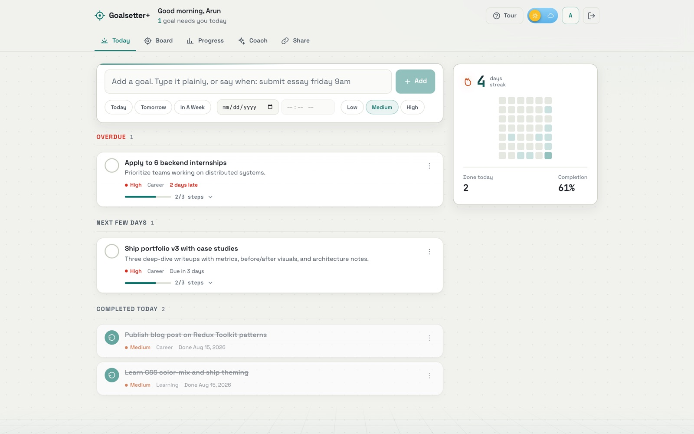
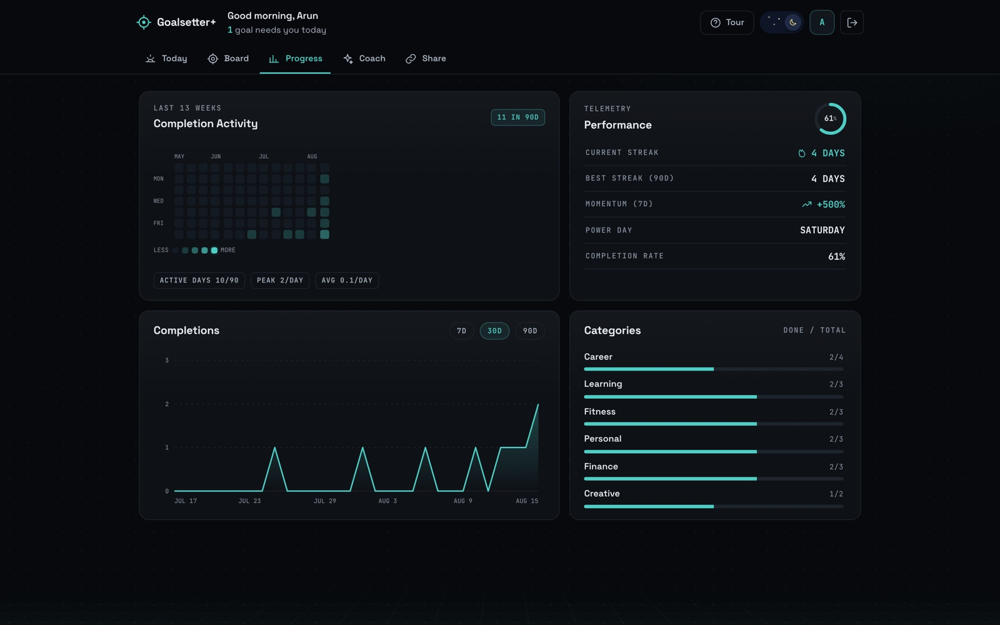
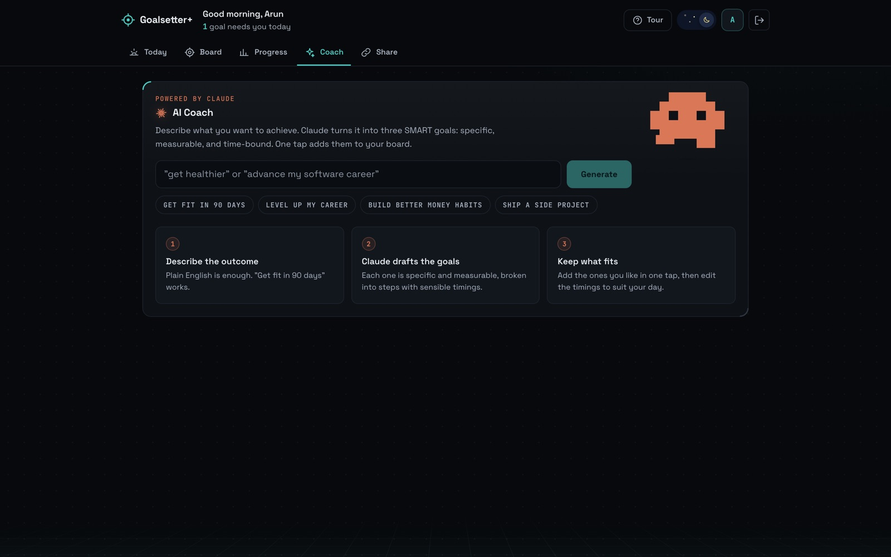
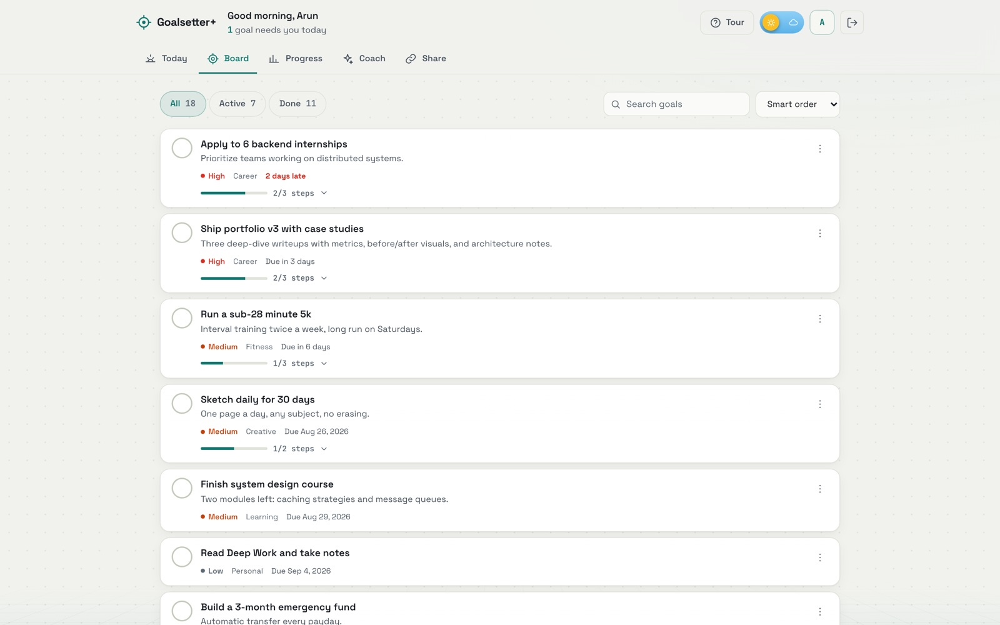
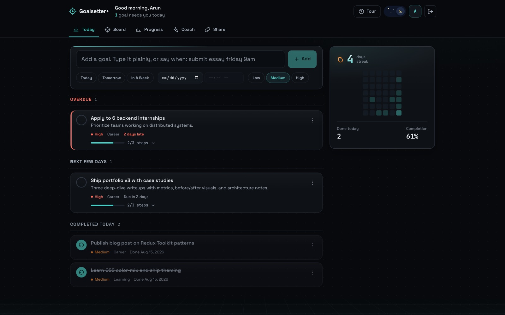
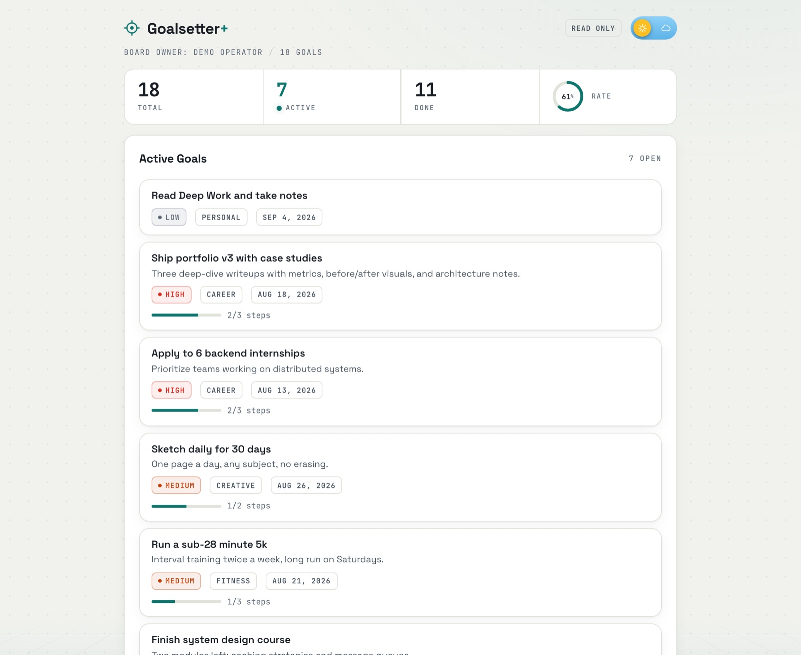
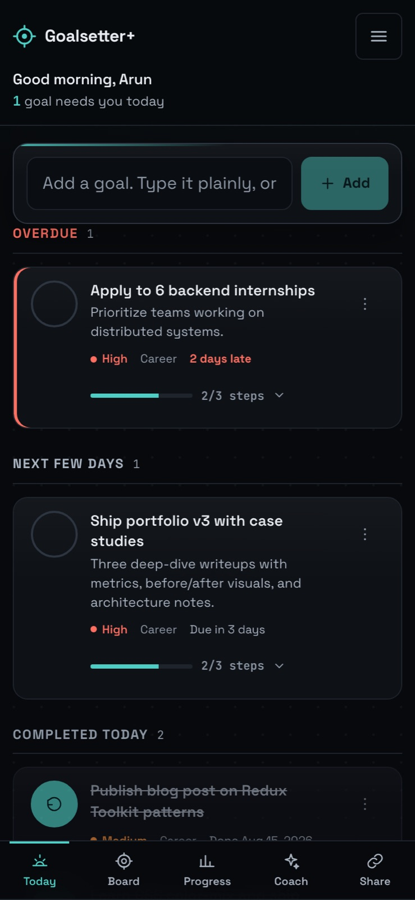

# Goalsetter+

A full-stack goal tracking system built on the MERN stack. Designed for daily use: the home screen answers "what do I do today?" in under two seconds, every write lands optimistically, and the streak chain is the thing that keeps you coming back.

**Live demo:** [goalsetter-plus.vercel.app](https://goalsetter-plus.vercel.app)

Two ways in, neither needs a signup:
- Press **Try the live demo** on the sign-in screen for a preloaded board with real history
- Or open the [public demo board](https://goalsetter-plus.vercel.app/share/demoboard), which is the read-only share link feature in action

---

## Screenshots

### Today
The home surface. Overdue first, then due today, then the next few days, with a momentum sidebar carrying the streak and a six-week completion chain.




### Progress
A 13-week contribution heatmap, streak and momentum telemetry, a completions chart, and per-category progress. Every chart here is hand-built SVG, no charting library.



### AI Coach
Claude turns a vague intent into specific goals, each broken into steps with suggested timings. Ask for more without losing what is already on screen.



### Board, sign in, sharing, mobile

| Board | Sign in |
| --- | --- |
|  |  |

| Public share link | Mobile |
| --- | --- |
|  |  |

---

## Design

A custom design system written from scratch in plain CSS, with no UI framework:

- Two themes, dark and light, on one muted teal accent chosen to sit calmly on both a near-black and an off-white background
- Flash-free theming: an inline head script applies the saved mode before first paint, so a refresh never flickers
- A 7-step type scale and a 4px spacing scale, replacing what used to be 21 improvised font sizes
- Space Grotesk for the interface, JetBrains Mono for data readouts, with tabular numerals throughout
- Custom SVG icon set, an animated day and night switch, and a pixel companion in the AI Coach
- Desktop is a two column workspace: a readable focus column beside a sticky momentum sidebar
- Mobile first: thumb-reachable bottom navigation, a menu sheet instead of a crowded top bar, no horizontal overflow, and no tap target under 44px
- Small text passes WCAG AA contrast in both themes

## Features

### Today
- One question answered first: what needs you now
- One-line quick add. Type it and press Enter
- Say when in plain words, "submit essay friday 9am", or set the date and time by hand. Manual entry never rewrites your title
- Steps tick inline on the card, no modal round trip
- Optimistic writes: the interface moves in about 30ms and rolls back with a plain-English message if the server refuses

### Goals
- Full CRUD with priorities, categories, notes, and steps
- Real times on goals, and an optional time on each individual step, so a workout or a study block carries its own slot
- Overdue detection with human phrasing: "Due today at 1:00 PM", "2 days late"
- Smart ordering: overdue first, then due soonest, then priority
- Keyboard shortcuts: N to add, / to search

### Progress
- GitHub-style completion heatmap over the last 13 weeks
- Streak engine: current streak, best streak, 7-day momentum, and your most productive weekday
- Completions chart with 7, 30, and 90 day ranges, all sliced client-side from a single fetch
- Completions tracked with a dedicated `completedAt` timestamp for accuracy

### AI Coach (Claude API)
- Describe an intent in plain English and Claude Haiku returns SMART goals
- Each suggestion arrives with steps and suggested timings that carry across when you add it
- Show more asks for another set, and tells the model what it already produced so it does not repeat itself
- Rate limited server-side to control cost

### Sharing and onboarding
- Read-only public link to your board, revocable and rotatable
- A guided tour that runs itself for the demo account and for new sign ups, replayable from the Tour button

### Resilience
- Designed error, empty, offline, and cold-start states, each with a way out
- A failed load says so and offers a retry instead of rendering an empty board and implying your data is gone
- Internal server and SDK messages never reach the screen

## Accessibility

- `header`, `nav`, and `main` landmarks with a proper heading hierarchy
- Goal lists are real lists, and every control has an accessible name
- `aria-live` announcements for every optimistic action and every rollback
- Skip link, visible focus rings, and 44px minimum touch targets

---

## Tech Stack

**Frontend**
- React 19 + Vite, code-split routes via `React.lazy`
- Redux Toolkit with optimistic reducers and snapshot rollback
- React Router v7
- chrono-node for natural language dates
- Axios with a request interceptor for auth and a 401 interceptor for auto-logout
- Hand-rolled SVG charts, no charting dependency

**Backend**
- Node.js + Express
- MongoDB Atlas + Mongoose, with aggregation pipelines for analytics
- JWT authentication
- express-validator, Helmet, CORS, and rate limiting
- Anthropic SDK (Claude Haiku)

**Deployment**
- Frontend on Vercel, backend on Render, database on MongoDB Atlas

---

## API

**Meta**
```
GET    /api/health             Liveness check
GET    /api/version            Running commit, branch, and boot time
```

**Auth**
```
POST   /api/users              Register
POST   /api/users/login        Login
GET    /api/users/me           Current user
PUT    /api/users/me           Update profile (name, email, avatar, password)
```

**Goals** (protected)
```
GET    /api/goals              List goals
POST   /api/goals              Create goal
PUT    /api/goals/:id          Update goal (including dueDate, hasTime, subtasks)
DELETE /api/goals/:id          Delete goal
GET    /api/goals/stats        Total / active / completed / overdue
GET    /api/goals/analytics    Completions by day plus category breakdown
```

**AI** (protected, rate limited)
```
POST   /api/ai/suggest-goals   SMART goals from an intent (count, exclude)
```

**Share**
```
GET    /api/share/:token       Public, no auth
POST   /api/share/generate     Generate token (protected)
DELETE /api/share/revoke       Revoke token (protected)
```

---

## Local Setup

### 1. Clone
```bash
git clone https://github.com/akallam04/goalsetter-plus.git
cd goalsetter-plus
```

### 2. Backend
```bash
cd backend
npm install
```

Create `backend/.env`:
```
NODE_ENV=development
PORT=5001
MONGO_URI=your_mongodb_atlas_uri
JWT_SECRET=your_jwt_secret
CLIENT_URL=http://localhost:5173
ANTHROPIC_API_KEY=your_anthropic_key
```

```bash
npm run dev
```

Optional, seed or reset the public demo account used by the Try the live demo button:
```bash
npm run seed:demo
```

### 3. Frontend
```bash
cd frontend
npm install
```

Create `frontend/.env`:
```
VITE_API_URL=http://localhost:5001/api
```

```bash
npm run dev
```

Open [http://localhost:5173](http://localhost:5173)

### Checking what is deployed
```bash
curl -s https://goalsetter-plus.onrender.com/api/version
```
Returns the commit the API is actually running, which makes a stale deploy obvious immediately.

---

## Design Decisions

- **Optimistic writes with snapshot rollback.** Every mutation applies to local state immediately and stores the previous version keyed by request id. If the server refuses, the exact prior object is restored and the user is told. This took marking a goal done from 871ms of dead air to about 30ms.
- **A failed load must never look like an empty board.** The earlier version rendered "on track" and zero goals when the API was unreachable, which reads as data loss. Failures now have their own state with a working retry.
- **One error sanitizer.** Server and SDK messages are mapped to human sentences in a single module, so raw driver or provider text can never reach the interface.
- **`completedAt` instead of `updatedAt` for analytics.** `updatedAt` changes on any edit, making it useless as a proxy for completion date.
- **A single 90-day analytics fetch.** The 7, 30, and 90 day ranges plus the heatmap all derive from one request instead of refetching per toggle.
- **No chart library.** The area chart, heatmap, and rings are small hand-built SVG components. That removed roughly 100 kB gzipped and gives exact visual control.
- **Timezone-pinned day math.** Streaks, overdue checks, and heatmap cells use the same timezone as the backend aggregation so day boundaries always agree.
- **`forwardDate: true` in chrono-node.** "Sunday" always means the next upcoming Sunday.

---

## License

[MIT](LICENSE)
